# Autograph: A Cinderella Story in Code

> *"Once upon a time, there was someone who dreamed of building something magical. They didn't wait for a fairy godmother. They became the magic themselves."*

---

## The Cinderella Transformation

This isn't just an internship. **This is your transformation story.**

Like Cinderella, you start in the ashes — unknown, untested, full of potential but without the platform to show it. By the end of this journey, you'll walk into the ball as a **founding engineer** who built a real product.

```mermaid
flowchart TB
    subgraph Before["🧹 BEFORE THE BALL (Day 1)"]
        B1["Unknown to the industry"]
        B2["Skills scattered like cinders"]
        B3["No production experience"]
        B4["Dreams without infrastructure"]
    end

    subgraph Magic["✨ THE TRANSFORMATION (4 Weeks)"]
        M1["Build Autograph - a real AI platform"]
        M2["Master infrastructure magic"]
        M3["Ship code to production"]
        M4["Own your creation"]
    end

    subgraph After["👑 AT THE BALL (Demo Day)"]
        A1["Portfolio-worthy product"]
        A2["Founding engineer skills"]
        A3["Production-grade platform"]
        A4["Your story to tell forever"]
    end

    Before -->|"You cross the threshold"| Magic
    Magic -->|"The clock strikes midnight"| After

    style Magic fill:#9C27B0
    style After fill:#FFD700
```

**The glass slipper?** It's the platform you build. It fits only you — because you created it.

---

## Week 1 of 4: The Foundation Begins

> **Current Focus**: Product vision, infrastructure design, development environment
>
> **Key Deliverables**:
> - Working development cluster for Autograph
> - Infrastructure-as-Code foundation
> - Understanding of the product you're building
>
> **Extension Possible**: Based on active participation, quality work, communication, initiative.

---

## Your Fairy Tale: Autograph

**Every great story needs a magical artifact.** Ours is **Autograph** — an AI-powered content platform that transforms how creators work.

The name says it all: every piece of content bears the **authentic signature** of its creator, enhanced by AI magic. Like Cinderella's transformation didn't change who she was — it revealed who she could become.

```mermaid
flowchart TB
    subgraph Product["🏰 THE CASTLE (Autograph)"]
        CMS["Strapi CMS<br/>The Grand Hall"]
        AI["AI Services<br/>The Magic"]
        API["APIs<br/>The Gates"]
    end

    subgraph Users["👥 THE GUESTS (Your Users)"]
        Creators["Content Creators"]
        Devs["Developers"]
        Business["Business Teams"]
    end

    subgraph Platform["🛠️ THE FOUNDATION (Your Platform)"]
        K8s["Kubernetes<br/>Solid Ground"]
        GitOps["GitOps<br/>Self-Building Walls"]
        Obs["Observability<br/>The Watchtower"]
    end

    Users --> Product
    Product --> Platform

    style Product fill:#4CAF50
    style Platform fill:#2196F3
```

---

## The Story Structure

Like any great fairy tale, your journey has **four acts**:

---

## Why Stories Matter in Technical Work

> *"People don't remember facts. They remember stories."*

Look, we get it. Technical documentation can be dry. But consider this:

| Boring Approach | Storytelling Approach |
|-----------------|----------------------|
| "Deploy PostgreSQL with StatefulSet" | "Every kingdom needs a treasury. PostgreSQL is where Autograph keeps its most valuable asset—user content." |
| "Configure ingress rules" | "Build the gates to your castle. Who gets in? Who stays out? That's what ingress is for." |
| "Set up monitoring" | "The watchtower guards never sleep. Prometheus watches every heartbeat of your kingdom." |

**The technical content is identical. The engagement is 10x higher.**

---

## Your Character Sheet

Like every RPG hero, you have a class:

---

## Quick Start: Your First Quest

```mermaid
flowchart LR
    subgraph Setup["🎮 TUTORIAL"]
        S1["Join the Party"]
        S2["Get Your Gear"]
    end

    subgraph Vision["📜 THE PROPHECY"]
        V1["What is Autograph?"]
        V2["Why does it matter?"]
    end

    subgraph Architecture["🗺️ THE MAP"]
        A1["Product layers"]
        A2["Platform design"]
    end

    subgraph Build["⚔️ THE QUEST"]
        B1["Setup environment"]
        B2["Start building!"]
    end

    Setup --> Vision --> Architecture --> Build
```

| Quest Step | Document | What You'll Discover |
|------------|----------|---------------------|
| **0. Join the Guild** | Communication section below | Meet your fellowship |
| **1. The Prophecy** | [01-Product/01-Vision.md](./01-Product/01-Vision.md) | **What Autograph is and why it matters** |
| **2. The Map** | [02-Engineering/01-Architecture.md](./02-Engineering/01-Architecture.md) | How product and platform fit together |
| **3. First Quest** | [04-Internship/Exercises/01-Environment-Setup](./04-Internship/Exercises/01-Environment-Setup.md) | Get your hands dirty! |

---

## The Autograph Product

### What Users Get (The Magic)

| Feature | Description | The Cinderella Moment |
|---------|-------------|----------------------|
| **AI Content Generation** | Generate blog posts, descriptions, social media | *"Speak your wish, and words appear"* |
| **Smart Summarization** | Auto-summarize documents, meetings, videos | *"A thousand pages become ten"* |
| **Multi-language** | AI translation and localization | *"One story, told in every tongue"* |
| **Content Workflows** | Approval chains, scheduling, publishing | *"From rags to royal decree"* |
| **API-First** | Headless architecture | *"Magic that flows everywhere"* |

### Tech Stack (Your Magical Arsenal)

| Layer | Technology | Your Quest |
|-------|------------|------------|
| **CMS** | Strapi (Headless) | Build the grand hall |
| **AI** | Claude/OpenAI APIs | Summon the fairy godmother |
| **Database** | PostgreSQL | Guard the treasury |
| **Search** | Meilisearch | Find the glass slipper |
| **Cache** | Redis | Make everything instant |
| **Platform** | k3s, ArgoCD, Prometheus | **The foundation that holds the castle** |

---

## Documentation Structure: The Library

### 01-Product — The Vision

> *"Every great castle begins with a dream."*

| Document | Description |
|----------|-------------|
| [Vision](./01-Product/01-Vision.md) | **Start here**—Autograph product vision |
| [Market Context](./01-Product/02-Market-Context.md) | Why this product, why now |
| [Capabilities](./01-Product/03-Capabilities.md) | Features and SLOs |
| [Target Architecture](./01-Product/04-Target-Architecture.md) | Full system design |

### 02-Engineering — The Blueprints

> *"Now we draw the plans for the castle."*

| Document | Description |
|----------|-------------|
| [Architecture Overview](./02-Engineering/01-Architecture.md) | Product + platform layers |
| [Infrastructure-as-Code](./02-Engineering/02-Infrastructure-as-Code.md) | OpenTofu patterns |
| [Configuration Management](./02-Engineering/03-Configuration-Management.md) | Ansible best practices |
| [Container Orchestration](./02-Engineering/04-Container-Orchestration.md) | k3s/Kubernetes |
| [GitOps](./02-Engineering/05-GitOps.md) | ArgoCD deployments |

### 03-Platform — The Foundation

> *"A castle is only as strong as its foundation."*

| Document | Description |
|----------|-------------|
| [Cloud Platforms](./03-Platform/01-Cloud-Platforms.md) | Hetzner vs AWS |
| [Observability Stack](./03-Platform/02-Observability.md) | Metrics, logs, alerts |
| [Security](./03-Platform/03-Security.md) | Zero-trust, secrets |
| [Networking](./03-Platform/04-Networking.md) | Ingress, DNS, service mesh |
| [Custom Tooling](./03-Platform/05-Custom-Tooling.md) | Python automation |
| [Intern DNS Isolation](./03-Platform/06-Intern-DNS-Isolation.md) | Per-intern subdomain strategy |

### 04-Internship — Your Journey

> *"The hero sets forth from the ashes."*

| Document | Description |
|----------|-------------|
| [Before You Begin](./04-Internship/01-Before-You-Begin.md) | The Cinderella mindset |
| [Week-by-Week](./04-Internship/02-Week-by-Week.md) | Your 4-act transformation |
| [What You Build](./04-Internship/03-What-You-Build.md) | Autograph deliverables |
| [Your Role](./04-Internship/04-Your-Role.md) | Founding engineer |
| [Exercises](./04-Internship/Exercises/) | Hands-on building |

### 05-Future — Beyond the Happily Ever After

> *"And they lived happily ever after... but the story continues."*

| Document | Description |
|----------|-------------|
| [DevOps in the AI Agent Era](./05-Future/01-DevOps-AI-Agent-Era.md) | How roles are evolving |
| [Agent Orchestration Patterns](./05-Future/02-Agent-Orchestration-Patterns.md) | Multi-agent systems |

---

## What This Is (And What It's Not)

### This is NOT

### This IS

```mermaid
flowchart TB
    subgraph Epic["✅ YOUR CINDERELLA STORY"]
        E1["You ARE the magic"]
        E2["You build the glass slipper"]
        E3["You create your own transformation"]
        E4["You walk into the ball as yourself"]
    end

    style Epic fill:#ccffcc
```

---

## Success Metrics: Your Transformation Milestones

| Metric | Target | The Cinderella Moment |
|--------|--------|----------------------|
| **Content API latency** | < 100ms p95 | *"Fast as midnight's stroke"* |
| **AI generation time** | < 3 seconds | *"Magic shouldn't keep royalty waiting"* |
| **Deployment frequency** | 50+/day capable | *"A new dress every hour"* |
| **Platform cost** | < $500/month | *"Royal quality, commoner's budget"* |
| **Uptime** | 99.9% | *"The castle never sleeps"* |

---

## Using This Documentation

### Recommended: Obsidian (Your Spellbook)

Download **[Obsidian](https://obsidian.md/)** for the best experience:
- **Graph View** — See how all the knowledge connects
- **Quick Navigation** — `Ctrl/Cmd + O` teleports you
- **Mermaid Diagrams** — The maps render beautifully

**Setup**: Open the `DevOps` folder as a vault in Obsidian.

---

## The Hero's Support System

- **Teams/Slack**: #devops-internship channel (your fellowship)
- **Documentation**: This vault (your spellbook)
- **Mentors**: Available for architecture questions (the wise council)

> *Remember: Cinderella didn't wait for rescue. She showed up at the ball. Research first, ask second. That's how legends are made.*

---

## Communication & Remote Working

| Guide | What You'll Learn |
|-------|-------------------|
| [Teams Setup](../How-We-Communicate/01-Teams-Getting-Started.md) | Join the fellowship |
| [Communication Protocol](../How-We-Communicate/02-Communication-Protocol.md) | Which channel for what |
| [Live Sessions](../How-We-Communicate/03-Live-Sessions.md) | Gather for the royal council |
| [Tools & Workflows](../How-We-Communicate/04-Tools-and-Workflows.md) | Your equipment |

---

## The Midnight Promise

> *"At midnight, the magic fades... unless you built it yourself."*

In the original fairy tale, Cinderella's transformation was temporary — given by someone else, taken away at midnight.

**Your transformation is different.** What you build here, you keep. The skills, the platform, the product, the story — it's all yours. No one can take it back at midnight because **you created the magic yourself.**

Autograph is waiting. The first chapter is written.

**Now it's your turn to write the rest.**

---

*Last Updated: 2026-02-02*
