# ContentAI Internship: Build a Startup from Scratch

---

## Week 1 of 4: Foundation Phase

> **Current Focus**: Product vision, infrastructure design, development environment
>
> **Key Deliverables**:
> - Working development cluster for ContentAI
> - Infrastructure-as-Code foundation
> - Understanding of the product you're building
>
> **Extension Possible**: Based on active participation, quality work, communication, initiative.

---

## The Mission

**You're not here to learn DevOps. You're here to build a startup.**

Welcome to **ContentAI**—an AI-powered content platform that helps creators and businesses generate, manage, and distribute content at scale. Think Strapi meets GPT, with infrastructure that scales from your first user to your millionth.

**By the end of this internship, you'll have built:**
- A real AI-powered content platform (not a demo)
- Production-grade infrastructure that could run in a YC-funded startup
- The skills to be a founding engineer, not just an ops person

---

## Quick Start

| Step | Document | Focus |
|------|----------|-------|
| **0. Setup** | Communication section below | Teams & Tools, webinar link |
| **1. Vision** | [01-Product/01-Vision.md](./01-Product/01-Vision.md) | **What ContentAI is and why it matters** |
| **2. Architecture** | [02-Engineering/01-Architecture.md](./02-Engineering/01-Architecture.md) | How product and platform fit together |
| **3. Build** | [04-Internship/Exercises/01-Environment-Setup](./04-Internship/Exercises/01-Environment-Setup.md) | Get your hands dirty! |

---

## What Makes This Different

This is **NOT** a traditional DevOps internship where you:
- Maintain someone else's infrastructure
- Watch dashboards and respond to alerts
- Run the same deployment scripts repeatedly

This **IS** a startup founding experience where you:
- **Build a real product** that solves a real problem
- **Design the platform** that makes the product scale
- **Ship features** that users would actually pay for
- **Learn** how YC-caliber startups are built from day one

```mermaid
flowchart TB
    subgraph Traditional["Traditional DevOps Role"]
        T1["Support existing systems"]
        T2["React to incidents"]
        T3["Infrastructure is THE job"]
    end

    subgraph Startup["Startup Founder Role (This Program)"]
        P1["Build the product"]
        P2["Infrastructure enables the product"]
        P3["Ship features, iterate fast"]
        P4["Own the entire stack"]
    end

    Traditional -.->|"You're NOT doing this"| X["❌"]
    Startup -.->|"You ARE doing this"| Y["✅"]
```

> *"The best startups seem to start from scratch. The founders just decided what they wanted to build, then built it."*
> — **Paul Graham**, Y Combinator

---

## The ContentAI Product

### What Users Get

| Feature | Description |
|---------|-------------|
| **AI Content Generation** | Generate blog posts, product descriptions, social media from prompts |
| **Smart Summarization** | Auto-summarize documents, meetings, videos |
| **Multi-language** | AI translation and localization for global audiences |
| **Content Workflows** | Approval chains, scheduling, multi-channel publishing |
| **API-First** | Headless architecture—content goes anywhere |

### Tech Stack

| Layer | Technology | Your Role |
|-------|------------|-----------|
| **CMS** | Strapi (Headless) | Deploy and configure |
| **AI** | Claude/OpenAI APIs | Integrate AI services |
| **Database** | PostgreSQL | Production setup |
| **Search** | Meilisearch | Fast content search |
| **Cache** | Redis | Performance layer |
| **Frontend** | Next.js | Admin dashboard |
| **Platform** | k3s, ArgoCD, Prometheus | **What makes it all work** |

---

## Documentation Structure

### 01-Product — What You're Building

| Document | Description |
|----------|-------------|
| [Vision](./01-Product/01-Vision.md) | **Start here**—ContentAI product vision |
| [Market Context](./01-Product/02-Market-Context.md) | Why this product, why now |
| [Capabilities](./01-Product/03-Capabilities.md) | Features and SLOs |
| [Target Architecture](./01-Product/04-Target-Architecture.md) | Full system design |

### 02-Engineering — How to Build It

| Document | Description |
|----------|-------------|
| [Architecture Overview](./02-Engineering/01-Architecture.md) | Product + platform layers |
| [Infrastructure-as-Code](./02-Engineering/02-Infrastructure-as-Code.md) | OpenTofu patterns |
| [Configuration Management](./02-Engineering/03-Configuration-Management.md) | Ansible best practices |
| [Container Orchestration](./02-Engineering/04-Container-Orchestration.md) | k3s/Kubernetes |
| [GitOps](./02-Engineering/05-GitOps.md) | ArgoCD deployments |

### 03-Platform — Infrastructure That Scales

| Document | Description |
|----------|-------------|
| [Cloud Platforms](./03-Platform/01-Cloud-Platforms.md) | Hetzner vs AWS |
| [Observability Stack](./03-Platform/02-Observability.md) | Metrics, logs, alerts |
| [Security](./03-Platform/03-Security.md) | Zero-trust, secrets |
| [Networking](./03-Platform/04-Networking.md) | Ingress, DNS, service mesh |
| [Custom Tooling](./03-Platform/05-Custom-Tooling.md) | Python automation |

### 04-Internship — Your Journey

| Document | Description |
|----------|-------------|
| [Before You Begin](./04-Internship/01-Before-You-Begin.md) | Startup mindset |
| [Week-by-Week](./04-Internship/02-Week-by-Week.md) | 4-week progression |
| [What You Build](./04-Internship/03-What-You-Build.md) | ContentAI deliverables |
| [Your Role](./04-Internship/04-Your-Role.md) | Founding engineer |
| [Exercises](./04-Internship/Exercises/) | Hands-on building |

### 05-Future — Where This Is Going

| Document | Description |
|----------|-------------|
| [DevOps in the AI Agent Era](./05-Future/01-DevOps-AI-Agent-Era.md) | How roles are evolving |
| [Agent Orchestration Patterns](./05-Future/02-Agent-Orchestration-Patterns.md) | Multi-agent systems |

---

## Your 4-Week Journey

```mermaid
timeline
    title Building ContentAI
    section Week 1 — Foundation
        Infrastructure : OpenTofu modules
                       : Ansible hardening
                       : k3s cluster
    section Week 2 — Product
        ContentAI : Deploy Strapi CMS
                  : PostgreSQL setup
                  : AI service integration
    section Week 3 — Scale
        GitOps : ArgoCD automation
               : CI/CD pipeline
               : Observability stack
    section Week 4 — Launch
        Production : Security hardening
                   : Performance tuning
                   : Launch readiness
```

---

## Success Metrics

| Metric | Target | Why It Matters |
|--------|--------|----------------|
| **Content API latency** | < 100ms p95 | User experience |
| **AI generation time** | < 3 seconds | Creator productivity |
| **Deployment frequency** | 50+/day capable | Iteration speed |
| **Platform cost** | < $500/month | Startup runway |
| **Uptime** | 99.9% | User trust |

---

## Using This Documentation

### Recommended: Obsidian

Download **[Obsidian](https://obsidian.md/)** for the best experience:
- Graph View for visualizing connections
- Quick Navigation with `Ctrl/Cmd + O`
- Mermaid diagrams render beautifully

**Setup**: Open the `DevOps` folder as a vault in Obsidian.

### Alternative

All links and diagrams work on GitHub web UI.

---

## Getting Help

- **Teams/Slack**: #devops-internship channel
- **Documentation**: This vault
- **Mentors**: Available for architecture questions (after you've tried first)

**Remember**: Startup founders figure things out. Research first, ask second.

---

## Communication & Remote Working

| Guide | What You'll Learn |
|-------|-------------------|
| [Teams Setup](../How-We-Communicate/01-Teams-Getting-Started.md) | Microsoft Teams setup |
| [Communication Protocol](../How-We-Communicate/02-Communication-Protocol.md) | Which channel to use |
| [Live Sessions](../How-We-Communicate/03-Live-Sessions.md) | Webinar format, demos |
| [Tools & Workflows](../How-We-Communicate/04-Tools-and-Workflows.md) | Git, cloud access |

---

*Last Updated: 2026-02-02*
