# ContentAI: Your Startup Story Begins

> *"Once upon a time, in a world drowning in content needs, a team of engineers decided to build something magical..."*

---

## Week 1 of 4: The Foundation Begins

> **Current Focus**: Product vision, infrastructure design, development environment
>
> **Key Deliverables**:
> - Working development cluster for ContentAI
> - Infrastructure-as-Code foundation
> - Understanding of the product you're building
>
> **Extension Possible**: Based on active participation, quality work, communication, initiative.

---

## The Story So Far

**Every great startup begins with a problem worth solving.**

Remember the stories your grandparents told you at bedtime? They hooked you from the first line, kept you engaged through every twist, and left you wanting more. **That's what we're building here**—not boring infrastructure docs, but a compelling story of creation.

You're the protagonist in this tale. And like every hero's journey, it begins with a call to adventure:

```mermaid
flowchart TB
    subgraph Chapter1["📖 CHAPTER 1: The Problem"]
        Problem["Content creation is slow, expensive, and doesn't scale"]
    end

    subgraph Chapter2["📖 CHAPTER 2: The Solution"]
        Solution["ContentAI — AI-powered content at the speed of thought"]
    end

    subgraph Chapter3["📖 CHAPTER 3: The Hero (You)"]
        Hero["A founding engineer builds the platform that makes it possible"]
    end

    subgraph Chapter4["📖 CHAPTER 4: The Happy Ending"]
        Victory["Real users create 10x more content at 10% of the cost"]
    end

    Chapter1 --> Chapter2 --> Chapter3 --> Chapter4

    style Chapter3 fill:#4CAF50
    style Chapter4 fill:#FFD700
```

**Your role**: You're not Cinderella waiting for a fairy godmother. **You're the one building the magic.**

---

## The Mission: Build Magic, Not Infrastructure

**You're not here to learn DevOps. You're here to build a startup.**

Welcome to **ContentAI**—an AI-powered content platform that transforms how creators work. Like a fairy tale where ordinary things become extraordinary, we turn blank pages into published content with a touch of AI.

```mermaid
flowchart TB
    subgraph Product["🏰 THE CASTLE (Your Product)"]
        CMS["Strapi CMS<br/>Content Kingdom"]
        AI["AI Services<br/>The Magic"]
        API["APIs<br/>The Gates"]
    end

    subgraph Users["👥 THE VILLAGERS (Your Users)"]
        Creators["Content Creators"]
        Devs["Developers"]
        Business["Business Teams"]
    end

    subgraph Platform["🛠️ THE FOUNDATION (Your Platform)"]
        K8s["Kubernetes<br/>Solid Ground"]
        GitOps["GitOps<br/>Automatic Building"]
        Obs["Observability<br/>The Watchtower"]
    end

    Users --> Product
    Product --> Platform

    style Product fill:#4CAF50
    style Platform fill:#2196F3
```

**By the end of this story:**
- You'll have built a **real AI-powered content platform** (not a demo)
- Infrastructure that could run a **YC-funded startup**
- Skills to be a **founding engineer**, not just an ops person

---

## Why Stories Matter in Technical Work

> *"People don't remember facts. They remember stories."*

Look, we get it. Technical documentation can be dry. But consider this:

| Boring Approach | Storytelling Approach |
|-----------------|----------------------|
| "Deploy PostgreSQL with StatefulSet" | "Every kingdom needs a treasury. PostgreSQL is where ContentAI keeps its most valuable asset—user content." |
| "Configure ingress rules" | "Build the gates to your castle. Who gets in? Who stays out? That's what ingress is for." |
| "Set up monitoring" | "The watchtower guards never sleep. Prometheus watches every heartbeat of your kingdom." |

**The technical content is identical. The engagement is 10x higher.**

This documentation is written as a journey. Some pages will feel like chapters in an adventure. Some will have the practical details you need. All of them are designed to keep you hooked.

---

## Your Character Profile

Like every RPG, you start with a class. Here's yours:

---

## Quick Start: Your First Quest

```mermaid
flowchart LR
    subgraph Setup["🎮 TUTORIAL"]
        S1["Join the Party"]
        S2["Get Your Gear"]
    end

    subgraph Vision["📜 THE PROPHECY"]
        V1["What is ContentAI?"]
        V2["Why does it matter?"]
    end

    subgraph Architecture["🗺️ THE MAP"]
        A1["Product layers"]
        A2["Platform design"]
    end

    subgraph Build["⚔️ THE QUEST"]
        B1["Setup environment"]
        B2["Start building!"]
    end

    Setup --> Vision --> Architecture --> Build
```

| Quest Step | Document | What You'll Discover |
|------------|----------|---------------------|
| **0. Join the Guild** | Communication section below | Meet your party |
| **1. The Prophecy** | [01-Product/01-Vision.md](./01-Product/01-Vision.md) | **What ContentAI is and why it matters** |
| **2. The Map** | [02-Engineering/01-Architecture.md](./02-Engineering/01-Architecture.md) | How product and platform fit together |
| **3. First Quest** | [04-Internship/Exercises/01-Environment-Setup](./04-Internship/Exercises/01-Environment-Setup.md) | Get your hands dirty! |

---

## The ContentAI Product

### What Users Get (The Magic)

| Feature | Description | The Story |
|---------|-------------|-----------|
| **AI Content Generation** | Generate blog posts, descriptions, social media | *"Speak your idea, and words appear"* |
| **Smart Summarization** | Auto-summarize documents, meetings, videos | *"A thousand pages become ten"* |
| **Multi-language** | AI translation and localization | *"One story, told in every tongue"* |
| **Content Workflows** | Approval chains, scheduling, publishing | *"From draft to kingdom-wide in a day"* |
| **API-First** | Headless architecture | *"Content that flows like water, everywhere"* |

### Tech Stack (Your Arsenal)

| Layer | Technology | Your Quest |
|-------|------------|------------|
| **CMS** | Strapi (Headless) | Build the content throne |
| **AI** | Claude/OpenAI APIs | Summon the AI djinn |
| **Database** | PostgreSQL | Guard the treasury |
| **Search** | Meilisearch | Find any needle in any haystack |
| **Cache** | Redis | Make everything instant |
| **Platform** | k3s, ArgoCD, Prometheus | **The foundation that holds it all** |

---

## Documentation Structure: The Library

### 01-Product — The Vision

> *"Every great castle begins with a dream."*

| Document | Description |
|----------|-------------|
| [Vision](./01-Product/01-Vision.md) | **Start here**—ContentAI product vision |
| [Market Context](./01-Product/02-Market-Context.md) | Why this product, why now |
| [Capabilities](./01-Product/03-Capabilities.md) | Features and SLOs |
| [Target Architecture](./01-Product/04-Target-Architecture.md) | Full system design |

### 02-Engineering — The Blueprints

> *"Now we draw the plans."*

| Document | Description |
|----------|-------------|
| [Architecture Overview](./02-Engineering/01-Architecture.md) | Product + platform layers |
| [Infrastructure-as-Code](./02-Engineering/02-Infrastructure-as-Code.md) | OpenTofu patterns |
| [Configuration Management](./02-Engineering/03-Configuration-Management.md) | Ansible best practices |
| [Container Orchestration](./02-Engineering/04-Container-Orchestration.md) | k3s/Kubernetes |
| [GitOps](./02-Engineering/05-GitOps.md) | ArgoCD deployments |

### 03-Platform — The Foundation

> *"A castle is only as strong as its foundation."*

| Document | Description |
|----------|-------------|
| [Cloud Platforms](./03-Platform/01-Cloud-Platforms.md) | Hetzner vs AWS |
| [Observability Stack](./03-Platform/02-Observability.md) | Metrics, logs, alerts |
| [Security](./03-Platform/03-Security.md) | Zero-trust, secrets |
| [Networking](./03-Platform/04-Networking.md) | Ingress, DNS, service mesh |
| [Custom Tooling](./03-Platform/05-Custom-Tooling.md) | Python automation |

### 04-Internship — Your Journey

> *"The hero sets forth."*

| Document | Description |
|----------|-------------|
| [Before You Begin](./04-Internship/01-Before-You-Begin.md) | Startup mindset |
| [Week-by-Week](./04-Internship/02-Week-by-Week.md) | 4-week progression |
| [What You Build](./04-Internship/03-What-You-Build.md) | ContentAI deliverables |
| [Your Role](./04-Internship/04-Your-Role.md) | Founding engineer |
| [Exercises](./04-Internship/Exercises/) | Hands-on building |

### 05-Future — Beyond the Horizon

> *"And they lived happily ever after... but the story continues."*

| Document | Description |
|----------|-------------|
| [DevOps in the AI Agent Era](./05-Future/01-DevOps-AI-Agent-Era.md) | How roles are evolving |
| [Agent Orchestration Patterns](./05-Future/02-Agent-Orchestration-Patterns.md) | Multi-agent systems |

---

## The Four Chapters of Your Journey

---

## What This Is (And What It's Not)

### This is NOT

```mermaid
flowchart TB
    subgraph Boring["❌ NOT THIS"]
        B1["Watch dashboards all day"]
        B2["Maintain someone else's systems"]
        B3["Follow scripts blindly"]
        B4["Infrastructure is THE job"]
    end

    style Boring fill:#ffcccc
```

### This IS

```mermaid
flowchart TB
    subgraph Epic["✅ THIS IS YOU"]
        E1["Build a real product"]
        E2["Design the platform"]
        E3["Ship features users want"]
        E4["Own the entire story"]
    end

    style Epic fill:#ccffcc
```

---

## Success Metrics: Your Scoreboard

| Metric | Target | The Story |
|--------|--------|-----------|
| **Content API latency** | < 100ms p95 | *"Fast as thought"* |
| **AI generation time** | < 3 seconds | *"Magic shouldn't keep you waiting"* |
| **Deployment frequency** | 50+/day capable | *"Ship or die"* |
| **Platform cost** | < $500/month | *"Startup-friendly"* |
| **Uptime** | 99.9% | *"The castle never sleeps"* |

---

## Using This Documentation

### Recommended: Obsidian (Your Spellbook)

Download **[Obsidian](https://obsidian.md/)** for the best experience:
- **Graph View** — See how all the knowledge connects
- **Quick Navigation** — `Ctrl/Cmd + O` teleports you
- **Mermaid Diagrams** — The maps render beautifully

**Setup**: Open the `DevOps` folder as a vault in Obsidian.

---

## The Hero's Support System

- **Teams/Slack**: #devops-internship channel (your fellowship)
- **Documentation**: This vault (your spellbook)
- **Mentors**: Available for architecture questions (the wise elders)

> *Remember: Heroes figure things out. Research first, ask second. That's how legends are made.*

---

## Communication & Remote Working

| Guide | What You'll Learn |
|-------|-------------------|
| [Teams Setup](../How-We-Communicate/01-Teams-Getting-Started.md) | Join the fellowship |
| [Communication Protocol](../How-We-Communicate/02-Communication-Protocol.md) | Which channel for what |
| [Live Sessions](../How-We-Communicate/03-Live-Sessions.md) | Gather for the council |
| [Tools & Workflows](../How-We-Communicate/04-Tools-and-Workflows.md) | Your equipment |

---

## One Last Thing

> *"The beginning is always today."*
> — **Mary Shelley** (author of Frankenstein)

You're not here to read documentation. You're here to **build something that matters**.

The fairy tales we loved as children weren't about following instructions. They were about heroes who **took action** when the world needed them.

ContentAI needs you. The first chapter is written. **Now it's your turn.**

---

*Last Updated: 2026-02-02*
