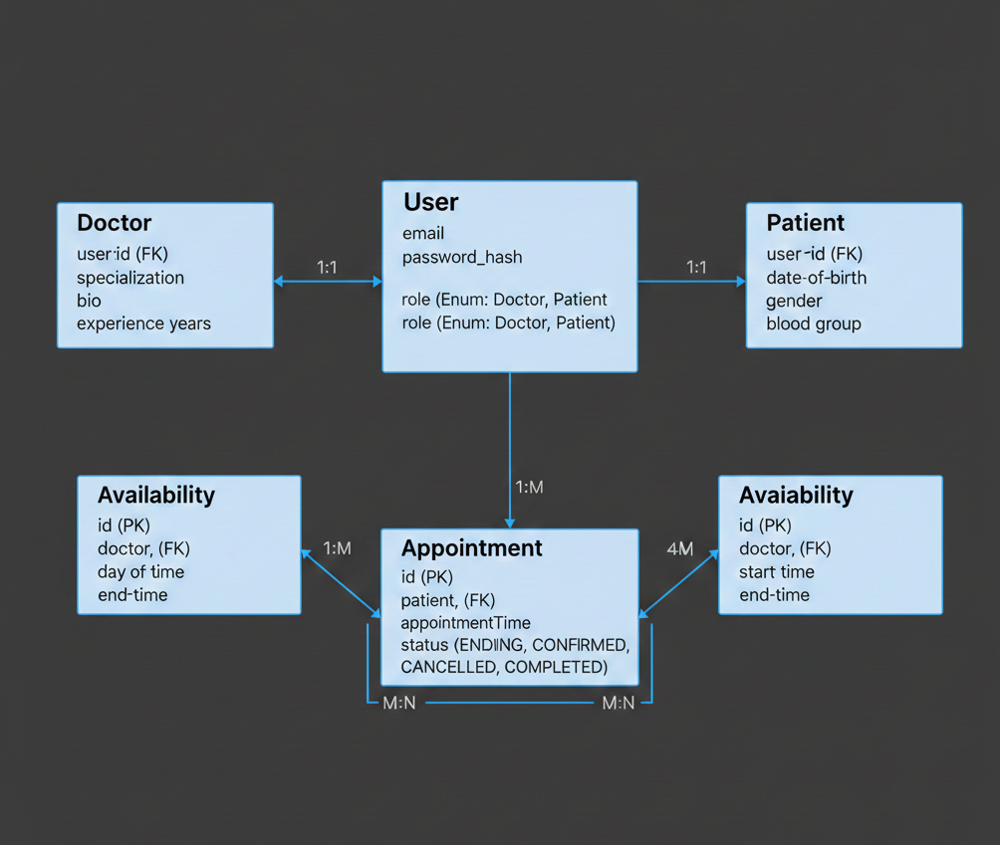

# Doctor Appointment Application
This folder contains the architectural design and documentation for the project.

## 📊 Database Design (ER Diagram)

### Core Entities
* **User**: Authentication and Role management.
* **Doctor/Patient**: Role-specific profiles.
* **Appointment**: Scheduling and status tracking.
