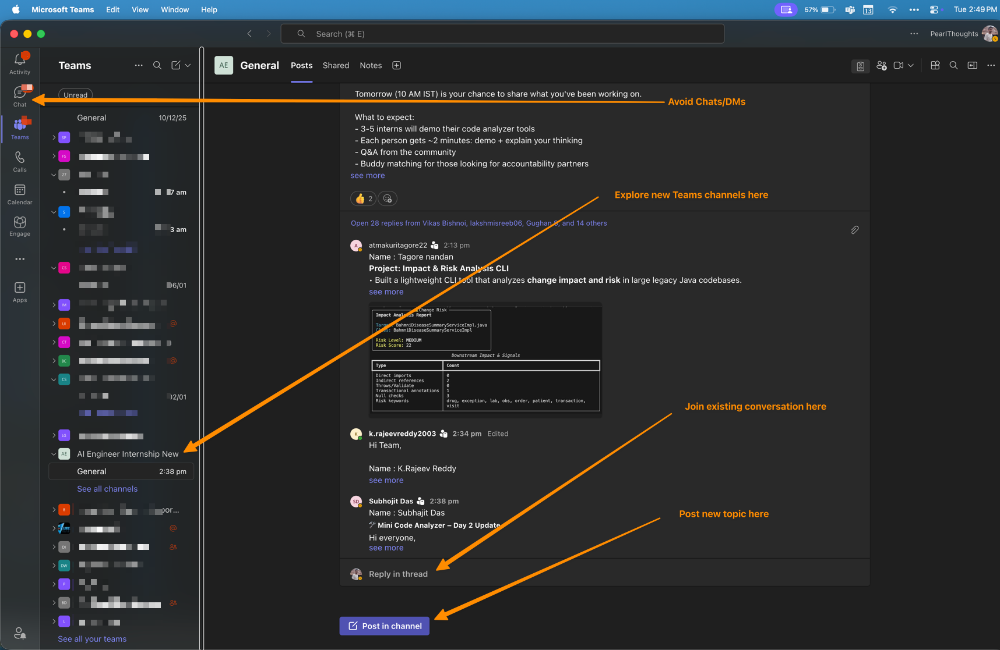

# Communication Protocol

> Know where to post, when to use threads, and how to think about communication in a remote internship.

---

## The Teams Interface

Before diving into protocols, familiarize yourself with the Microsoft Teams interface:



**Key areas:**
1. **Teams sidebar** (left) — Your teams and channels
2. **"See all channels"** — Discover channels you might not have joined
3. **Posts area** (center) — Channel conversations
4. **"Post in channel"** — Start a new topic
5. **"Reply in thread"** — Continue an existing conversation
6. **Avoid Chats/DMs** — Use channels for technical discussions (more on this below)

---

## Why Communication Structure Matters

### Conway's Law & Team Topologies

> "Organizations design systems that mirror their communication structures." — Melvin Conway

This principle from *Team Topologies* applies to internships too:

| Communication Pattern | What It Produces |
|----------------------|------------------|
| Scattered WhatsApp groups | Fragmented knowledge, lost context |
| Organized channels | Searchable history, shared learning |
| High-bandwidth sync (calls) | Quick decisions, alignment |
| Low-bandwidth async (posts) | Documented reasoning, inclusive participation |

**Our approach**: Use **Teams as the central hub** that connects all communication channels — live sessions, async discussions, code reviews, and documentation.

### The Pencil Analogy: Communication Cost

> **If a pencil costs ₹5, buy it for ₹5 — don't pay ₹100.**

Different communication channels have different "costs" (time, attention, interruption):

| Channel | Cost | Use For |
|---------|------|---------|
| **Live call / screen share** | ₹100 | Ground-breaking discoveries, complex debugging, high-value collaboration |
| **Real-time chat** | ₹50 | Urgent blockers, time-sensitive coordination |
| **Teams post** | ₹10 | Questions, progress updates, resource sharing |
| **Thread reply** | ₹5 | Follow-ups, answers, acknowledgments |
| **GitHub PR/Issue** | ₹5 | Code feedback, technical discussion |
| **Loom video** | ₹5 | Demos, explanations (async, watch anytime) |
| **Documentation** | ₹1 | Reference material (write once, read forever) |

**The principle**: Most communication is "₹5 pencil" work. Don't interrupt 150 people in a live session for something that belongs in a thread. Reserve real-time for moments that genuinely need it.

### Signal vs Noise

With 150+ interns, every message competes for attention:

| High Signal | Noise |
|-------------|-------|
| Specific question with context | "It doesn't work" |
| Solution that helps others | "Thanks!" as a new post |
| Progress update with learnings | "Hi everyone" with no content |
| Resource that solves common problem | Same question already answered |

**Your goal**: Maximize signal, minimize noise. Before posting, ask: "Will this help someone else, or is it just for me?"

---

## Quick Decision Guide

```
┌─────────────────────────────────────────────────────────────────────┐
│                    WHERE SHOULD I POST?                              │
├─────────────────────────────────────────────────────────────────────┤
│                                                                      │
│  Technical question?                                                 │
│    └─→ Post in the relevant Teams CHANNEL                           │
│                                                                      │
│  Follow-up to existing discussion?                                   │
│    └─→ Reply in the THREAD (not a new post)                         │
│                                                                      │
│  Certificate, stipend, appointment, leave?                           │
│    └─→ Email HR@PearlThoughts.com (NOT Teams)                       │
│                                                                      │
│  Urgent blocker during 10 AM session?                                │
│    └─→ Post in meeting CHAT (mentors will pick relevant ones)       │
│                                                                      │
│  Private/sensitive matter?                                           │
│    └─→ Direct message to your mentor or HR                          │
│                                                                      │
│  Quick informal chat with a peer?                                    │
│    └─→ Teams Chat (NOT WhatsApp — see below)                        │
│                                                                      │
└─────────────────────────────────────────────────────────────────────┘
```

---

## New Post vs Thread: The Decision

This is the most common source of channel clutter. Get this right.

### Start a NEW POST when:

| Scenario | Example |
|----------|---------|
| New question not yet discussed | "How do I handle circular imports in tree-sitter?" |
| Sharing a resource for everyone | "Found this article on AST parsing that helped me" |
| Progress update / milestone | "Week 2 update: Completed entity extraction" |
| New announcement | "Deployed my tool to Railway, here's the link" |

### Reply in THREAD when:

| Scenario | Example |
|----------|---------|
| Answering someone's question | [Reply to their post, not new post] |
| Adding to existing discussion | [Reply in thread] |
| Saying thanks | [React with 👍 or reply in thread] |
| Following up on your own question | [Reply to your original post] |

### The Test

> **Before clicking "Post in channel"**: Scroll up. Is there an existing conversation about this? If yes → reply in that thread.

---

## Exploring Channels

### Finding Channels

1. Click on your Team in the sidebar
2. Click **"See all channels"**
3. Browse available channels
4. Click a channel to join it

### Channel Types & Permissions

| Channel | Purpose | Can You Post? |
|---------|---------|---------------|
| **General** | Org-wide announcements, major updates | ⚠️ **Reply only** — reserved for org communication |
| **Support** | Technical help, debugging, cloud resources | ✅ Free to post |
| **DevOps** | Deployment, CI/CD, infrastructure | ✅ Free to post |
| **[Program-Specific]** | Your track's discussions | ✅ Free to post |

**Note**: General channel is for organization-wide communication. You can reply to threads there, but start new posts in program-specific or topic channels.

### Following & Unfollowing

- **Follow a channel**: Click the `...` menu → "Get notifications" for all activity
- **Unfollow**: Click `...` → "Turn off notifications" (still accessible, just not notified)
- **Pin important channels**: Right-click → "Pin" to keep them at the top

---

## Finding Your Internship Buddy

> **Software development is a team sport.** The best engineers aren't lone wolves — they're people who work well with others, learn together, and build lasting professional relationships.

One of the most valuable outcomes of this internship isn't just what you build — it's who you build relationships with.

### The Dating Analogy

Finding an internship buddy is like finding a good match:

| Dating | Finding a Buddy |
|--------|-----------------|
| Share what you bring to the table | Share your skills, interests, what you're learning |
| Value what they offer | Appreciate their strengths, learn from their approach |
| Interested in quality, not quantity | One good buddy > ten shallow connections |
| Grow together over time | Learn from each other, challenge each other |
| Not limited to one context | Relationship extends beyond the internship |

**The goal isn't to "network"** — it's to find people you genuinely enjoy working with and learning from.

### How to Find Potential Buddies

1. **Watch the channels** — Notice who asks interesting questions, shares helpful resources, or works on similar problems
2. **Check thread participants** — People replying to similar topics likely share your interests
3. **Demo sessions** — Pay attention during the 10 AM demos; someone's approach might resonate with yours
4. **Review posts** — Look at progress updates; find people at similar stages or working on related projects
5. **Pair programming sessions** — Nothing reveals compatibility like solving problems together

### Starting a Connection

| Do This | Not This |
|---------|----------|
| "I saw your post about AST parsing — I'm working on something similar. Want to compare approaches?" | "Hi, can we be friends?" |
| "Your demo yesterday was helpful. I'm stuck on a similar problem — mind if I DM you?" | "Can you help me with my code?" |
| "I'm good at X, you seem strong at Y — want to pair program and learn from each other?" | One-sided "teach me everything" |
| Reply thoughtfully to their posts first | Cold DM with no context |

### Pair Programming & Team Collaboration

We strongly encourage working together:

**Pair Programming**
- Schedule a Teams call with screen sharing
- One person "drives" (writes code), the other "navigates" (guides, catches errors)
- Switch roles every 20-30 minutes
- Great for: complex problems, learning new concepts, code review

**Small Team Arrangements**
- Form informal groups of 2-4 people working on related problems
- Share progress in a group chat
- Review each other's code before submitting
- Celebrate wins together

**Why this works:**
- You learn faster by explaining to others
- Bugs get caught earlier with another pair of eyes
- Motivation stays high when you're accountable to peers
- Different perspectives lead to better solutions

### Building the Relationship

**In Teams:**
- Reply to their posts, share relevant resources
- Offer help when you can — give before you ask
- Collaborate on problems asynchronously
- Celebrate their wins publicly

**Beyond the internship:**
- Connect on LinkedIn (professional, appropriate)
- Share contact info only when comfortable
- Keep the relationship professional and mutually beneficial
- Check in occasionally, even after the program ends

### Why This Matters

> The people you meet during internships often become lifelong professional connections.

These relationships can lead to:
- Future job referrals ("Hey, my company is hiring...")
- Collaboration on side projects
- Technical mentorship (both giving and receiving)
- Co-founders for future ventures
- A professional network that grows with your career

**Software engineering is a social sport.** The myth of the lone genius coder is exactly that — a myth. The best work happens when people collaborate, challenge each other, and build on each other's ideas.

**Invest in relationships, not just code. The code will be deprecated; the relationships won't.**

---

## Guest Access Limitations

As a Guest in the PearlThoughts organization, you have some limitations:

| Action | Can You Do It? |
|--------|----------------|
| View channel posts | ✅ Yes |
| Reply in threads | ✅ Yes |
| React to messages | ✅ Yes |
| Post new topics | ⚠️ Sometimes restricted |
| Create new channels | ❌ No |
| Add apps/tabs | ❌ No |
| Access all Teams in org | ❌ Only invited Teams |

**If you can't post but can reply**: This is a known Guest limitation. Reply to an existing thread or ask a mentor to post on your behalf. Contact HR@PearlThoughts.com if this persists.

---

## Teams as the Central Hub

### Why Teams, Not WhatsApp?

| | Teams | WhatsApp |
|-|-------|----------|
| **Searchable history** | ✅ Full search | ❌ Limited |
| **Organized channels** | ✅ Topic-based | ❌ Single chat |
| **File sharing** | ✅ Integrated | ⚠️ Basic |
| **Code formatting** | ✅ Markdown | ❌ None |
| **Privacy protection** | ✅ Work identity | ❌ Personal number exposed |
| **Mentor access** | ✅ Same platform | ❌ Requires personal contact |
| **Inclusive** | ✅ Async-friendly | ❌ Expects instant response |

**Important**: We do **not** use WhatsApp for internship communication. This protects:
- **Your privacy** — No need to share personal phone numbers
- **Your boundaries** — Work stays on work platforms
- **Your safety** — Professional context maintained

If someone asks for WhatsApp, redirect them to Teams. All informal and formal communication happens on Teams.

### How Teams Connects Everything

```
┌─────────────────────────────────────────────────────────────────────┐
│                    TEAMS AS CENTRAL HUB                              │
├─────────────────────────────────────────────────────────────────────┤
│                                                                      │
│                         ┌──────────┐                                │
│                         │  TEAMS   │                                │
│                         │ (async)  │                                │
│                         └────┬─────┘                                │
│                              │                                      │
│        ┌─────────────────────┼─────────────────────┐                │
│        │                     │                     │                │
│        ▼                     ▼                     ▼                │
│  ┌──────────┐         ┌──────────┐         ┌──────────┐            │
│  │  GitHub  │         │   Live   │         │  Email   │            │
│  │ PRs/Code │         │ Sessions │         │   (HR)   │            │
│  └──────────┘         └──────────┘         └──────────┘            │
│                                                                      │
│  Post PR links        Discuss in          Admin queries             │
│  in Teams channel     Teams chat          go to HR email            │
│                                                                      │
└─────────────────────────────────────────────────────────────────────┘
```

### When to Use Each Channel

| Channel | Bandwidth | Best For |
|---------|-----------|----------|
| **Live session (10 AM)** | High | Real-time Q&A, demos, announcements |
| **Teams posts** | Medium | Questions, discussions, progress updates |
| **Teams threads** | Medium | Follow-ups, detailed answers |
| **GitHub PR/Issues** | Low | Code-specific feedback, technical review |
| **Loom videos** | Low (async) | Demos, explanations, progress reports |
| **Email (HR)** | Low | Admin matters only |

---

## What Goes to HR (Not Teams)

Email **HR@PearlThoughts.com** for:

| Topic | Example |
|-------|---------|
| **Certificates** | "When will I receive my internship certificate?" |
| **Appointment Letters** | "I need my appointment letter for college records" |
| **Stipend** | "I haven't received my stipend for [month]" |
| **Leave Requests** | "I need leave for [dates] due to [reason]" |
| **Extension Requests** | "Can I extend my internship duration?" |
| **Reference Letters** | "Can I get a reference for job applications?" |
| **Personal Matters** | Health issues, family emergencies affecting attendance |

**Do not** post these in Teams channels. It clutters technical discussions and these are individual matters, not community topics.

---

## How to Ask Good Questions

### Bad Question:
> "It's not working. Help."

### Good Question:
> "I'm trying to parse ERPNext DocTypes using tree-sitter. When I run my script, I get an empty array for the 'fields' key. Here's my code: [link/snippet]. I've checked the JSON structure and the key exists. What am I missing?"

### The Pattern:
1. **What you're trying to do**
2. **What you tried**
3. **What happened (error messages, unexpected behavior)**
4. **What you expected**
5. **Code/screenshots if relevant**

### Before Asking

1. **Search first** — Has someone asked this already?
2. **Try solutions** — Did you attempt to solve it yourself?
3. **Document attempts** — What have you already tried?

---

## Bandwidth Mindfulness in Live Sessions

The 10 AM sessions have 150+ attendees. We encourage questions, but:

### In the Live Chat:
- **Do**: Post questions — mentors pick relevant ones for the group
- **Do**: Post quick tips or resources that help others
- **Don't**: Have back-and-forth conversations (take those to channels after)
- **Don't**: Post HR/admin queries (these won't be addressed live)

### For Demos:
- 2-3 interns showcase their best contributions each week
- Hand-raise feature to volunteer for feedback
- Keep feedback constructive and brief

---

## Response Expectations

| Channel | Expected Response Time |
|---------|------------------------|
| Teams channels | Within working hours (same day for urgent, 24h for others) |
| HR email | 2-3 business days |
| Live session chat | Real-time during session |
| Direct messages | When mentor is available |

**Note**: We're a small team. If you don't get a response:
1. Check if you asked in the right place
2. Check if your question was clear and complete
3. Follow up politely after appropriate time

---

## Etiquette

### Do:
- Be respectful and professional
- Help fellow interns when you can
- Share resources that helped you
- Use reactions (👍 ❤️ etc.) to acknowledge messages — reduces reply clutter

### Don't:
- Tag @everyone or @channel unless necessary
- Send multiple messages in quick succession (edit your message instead)
- Cross-post the same question in multiple channels
- Share confidential or proprietary information
- Ask for WhatsApp — keep communication on Teams

---

## Summary

| Situation | Action |
|-----------|--------|
| Technical question | Post in relevant Teams channel |
| Following up on discussion | Reply in thread |
| Admin/HR matter | Email HR@PearlThoughts.com |
| During 10 AM session | Use meeting chat |
| Private/sensitive | Direct message |
| Want to chat informally | Teams Chat (not WhatsApp) |

---

*Last Updated: 2026-01-13*
