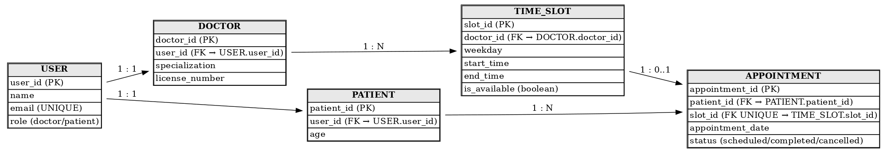

# Task 1 — ER Diagram (Schedula Application)

## 📌 Overview
This task involved analyzing the appointment scheduling workflow and designing an Entity Relationship Diagram (ERD) for the system. The ERD represents how data is structured, stored, and linked across entities.

---

## 🏗️ ER Diagram Preview

> The diagram models interaction between **Users**, **Doctors**, **Patients**, **Time Slots**, and **Appointments**.

---

## 🧱 Entities Used

| Entity | Description |
|--------|-------------|
| USER | Stores basic user profile details. One user can either be a doctor or a patient. |
| DOCTOR | Contains specialization and license information of doctors. |
| PATIENT | Contains basic medical profile information of patients. |
| TIME_SLOT | Represents the available time blocks provided by doctors. |
| APPOINTMENT | Manages appointment details between patients and doctors. |

---

## 🔗 Relationships

- One **USER** → One **DOCTOR** *(if user role is doctor)*
- One **USER** → One **PATIENT** *(if user role is patient)*
- One **DOCTOR** → Many **TIME_SLOT**
- One **TIME_SLOT** → Zero or One **APPOINTMENT**
- One **PATIENT** → Many **APPOINTMENT**

---

## ✅ Status
Task Completed and ER Diagram successfully created.
